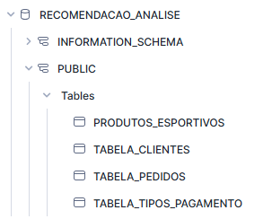

# Recomendação de Produtos com Análise de Cesta de Mercado

## Resumo 

## 

### 1 Introdução
Compreender os hábitos de consumo dos clientes é um fator crítico para o sucesso de estratégias de vendas, marketing e organização de produtos. Conhecer quais itens são frequentemente adquiridos em conjunto permite otimizar desde a disposição de produtos em lojas físicas e virtuais até a definição de campanhas promocionais mais assertivas.

**Este projeto tem como objetivo aplicar a técnica de Market Basket Analysis para identificar padrões de compra entre produtos, revelando associações que, muitas vezes, não são evidentes a partir da simples observação dos dados brutos.**

A análise será conduzida com base em Regras de Associação, utilizando o algoritmo Apriori, uma técnica amplamente reconhecida por sua eficiência em encontrar combinações de itens que ocorrem com frequência nas transações.

A partir dos padrões identificados, será possível automatizar a geração de recomendações de produtos e embasar ações estratégicas como agrupamento inteligente de produtos e ofertas personalizadas, promovendo assim uma experiência de compra mais relevante e aumentando o potencial de receita.

###  1.1 Regras de Associação
As regras de associação são técnicas de mineração de dados que buscam identificar relacionamentos frequentes entre itens em grandes conjuntos de dados.
Esses relacionamentos são expressos em regras do tipo: 
- "Se o cliente compra o produto A, então é provável que também compre o produto B."
- Cada regra é formada por um antecedente (o que o cliente compra) e um consequente (o que tende a ser comprado junto).
Essas regras são usadas para criar recomendações de produtos, campanhas de vendas cruzadas e para otimizar a organização de lojas.

###  1.2 Market Basket Analysis
O Market Basket Analysis (MBA) é a aplicação prática das regras de associação para analisar quais produtos são frequentemente comprados juntos.

Ele ajuda a entender o comportamento de compra dos clientes e é usado para sugerir produtos complementares, criar promoções combinadas e melhorar estratégias de vendas.


### 1.3 Métricas utilizadas
Durante a construção das regras de associação, três métricas principais são avaliadas:

| Métrica |  Definição | Fórmula|
| :------:| --------- | :-------:| 
Suporte       | Mede a frequência com que um item ou conjunto de itens aparece nas transações. Pode ser calculado para um único item (k=1) ou para combinações de dois, três ou mais itens (k>1).| Suporte (A) =  Transações (A) / Total de Transações|
Confiança      | Indica a probabilidade de o consequente ser comprado, dado que o antecedente já foi comprado.| Confiança (A ➔ B) = Transações com A e B / Transações com A  |
Lift     | Avalia a força da associação, comparando a probabilidade real de compra conjunta com a que seria esperada se os itens fossem independentes.   | Lift (A ➔ B) = Transações com A e B / (Transações com A) * (Transações com B) |

Essas métricas ajudam a garantir que apenas padrões fortes e relevantes sejam considerados no processo de recomendação.

### 1.4 Importância do Suporte Mínimo

Para otimizar o desempenho do algoritmo Apriori e garantir que os padrões identificados sejam realmente úteis, é necessário definir um suporte mínimo. Essa etapa é essencial porque:
- Considerar todos os itens, inclusive os muito raros, gera um número excessivo de combinações possíveis, aumentando o tempo e a complexidade de processamento.
- Focar apenas nos itens com suporte relevante melhora a qualidade das regras geradas e torna o processo mais eficiente.
- Ao aplicar um suporte mínimo, trabalhamos apenas com produtos que têm participação significativa nas transações, tornando os resultados mais relevantes para o negócio.

### 1.5 Cálculo de Suporte e Crescimento de Combinações (k-itens)
O algoritmo Apriori trabalha de forma progressiva, avaliando conjuntos de itens com tamanhos diferentes (k), e eliminando combinações que não atingem o suporte mínimo em cada etapa.
Esse processo ajuda a reduzir a complexidade e focar apenas nos padrões relevantes. O funcionamento é o seguinte:

- k = 1 (Itens individuais): Primeiro, verificamos quantas vezes cada item isolado aparece no total de transações. Eliminamos o item que não atingiu o suporte mínimo definido. 
- k = 2 (Pares de itens): Depois, formamos combinações de dois itens (pares) entre os itens que passaram da etapa anterior. Novamente, eliminamos os pares de itens cujo suporte for inferior ao suporte mínimo estabelecido.
- k = 3 (Trios de itens): A seguir, formamos combinações de três itens, apenas a partir dos pares que ainda atendem ao suporte mínimo. Então, verificamos em quantas transações esses conjuntos de três itens aparecem. Se o suporte mínimo for atendido, mantemos esses trios para formar regras futuras, caso contrário, eliminamos o conjunto que não atingiu o suporte mínimo.
- K > 3: O processo pode continuar ao unirmos trios que compartilham dois itens em comum para formar conjuntos de quatro itens. Lembrando que esse crescimento é controlado, pois, só combinamos conjuntos que têm elementos em comum e que atenderam o suporte mínimo nos passos anteriores.

Exemplo:

**Transações**
| ID | Itens |
|:--:|:-------------------------|
| 1  | Pão, Leite, Manteiga      |
| 2  | Pão, Leite, Manteiga      |
| 3  | Pão, Café                 |
| 4  | Pão, Leite, Manteiga      |
| 5  | Café, Refrigerante        |
| 6  | Pão, Café, Refrigerante   |


**Contagem dos Itens (k=1), Suporte = 2/6 - 33,33%**

| Item | Ocorrências |Suporte (Ocorrências/6) |Sobrevive? (≥2/6) |
|:-------------|:------------|:-----------|:-----------|
| Pão          | 5            | 83,3%     |  Sim         |
| Leite        | 3            | 50%       |  Sim         |
| Manteiga     | 3            | 50%       |  Sim         |
| Café         | 3            | 50%       |  Sim         |
| Refrigerante | 2            | 33,3%     |  Sim         |

**Contagem dos Itens (k=2), Suporte = 2/6 - 33,33%**
| Par | Ocorrências | Suporte (Ocorrências/6) | Sobrevive? (≥26)|
|:--------------|:-----------|:----------------|:--------|
| (Pão, Leite)  | 3          | 50%            | Sim      |
| (Pão, Manteiga)  | 3       | 50%            | Sim      |
| (Leite, Manteiga) | 3      | 50%            | Sim      |
| (Pão, Café)       | 2      | 33,3%          | Sim      |
| (Café, Refrigerante) | 2   | 33,3%          |  Sim     |
| (Pão, Refrigerante)  | 1   | 16,7%          |  Não     |
| (Leite, Café) | 0          | 0%             |  Não     |
| (Leite, Refrigerante) | 0  | 0%             |  Não     |
| (Manteiga, Café)  | 0      | 0%             |  Não     |
| (Manteiga, Refrigerante)| 0| 0%             |  Não     |


**Contagem dos Itens (k=3), Suporte = 2/6 - 33,33%**

| Trio | Ocorrências | Suporte (Ocorrências/6) | Sobrevive? (≥2/6)|
|:--------------|:-----------|:----------------|:--------|
| (Pão, Leite, Manteiga) | 3 | 50% | Sim |
| (Pão, Café, Refrigerante) | 1 | 16,7% | Não |

**Em análise de regras de associação, o suporte pode ser interpretado em termos de probabilidade:**
  - O suporte de um item (ou conjunto de itens) representa a probabilidade simples de uma transação escolhida aleatoriamente conter aquele item (ou conjunto). Suporte(A) = P(A), exemplo:
    - Considerando o conjunto de itens A: {Pão, Leite, Manteiga}, A aparece em 3 transações de um total de 6. Então: P(A)= 3​/6 =0,5 (50%)

### 1.6 Cálculo da Confiança

| Regra | Fórmula | Cálculo | Resultado |
|:---------------------------|:---------------------------------------------------|:---------------------|:-----------|
| Pão → Leite, Manteiga | (Suporte de Pão, Leite, Manteiga) ÷ (Suporte de Pão) | (3/6) ÷ (5/6) | 0,6 (ou 60%) |
| Leite → Pão, Manteiga | (Suporte de Pão, Leite, Manteiga) ÷ (Suporte de Leite) | (3/6) ÷ (3/6) | 1,0 (ou 100%) |
| Manteiga → Pão, Leite | (Suporte de Pão, Leite, Manteiga) ÷ (Suporte de Manteiga) | (3/6) ÷ (3/6) | 1,0 (ou 100%) |
| Pão e Leite → Manteiga | (Suporte de Pão, Leite, Manteiga) ÷ (Suporte de Pão e Leite) | (3/6) ÷ (3/6) | 1,0 (ou 100%) |
| Pão e Manteiga → Leite | (Suporte de Pão, Leite, Manteiga) ÷ (Suporte de Pão e Manteiga) | (3/6) ÷ (3/6) | 1,0 (ou 100%) |
| Leite e Manteiga → Pão | (Suporte de Pão, Leite, Manteiga) ÷ (Suporte de Leite e Manteiga) | (3/6) ÷ (3/6) | 1,0 (ou 100%) |

**Em análise de regras de associação, a confiança também pode ser interpretada em termos de probabilidade:**
  - A confiança de uma regra A → B representa a probabilidade condicional de uma transação conter B, dado que já sabemos que ela contém A. 
  - Confiança (A ➔ B) = P(B∣A) = P(A∩B)​/P(A). 
    - Onde P(B∣A) é a probabilidade condicional de ocorrer B dado que ocorreu A
  - Exemplo: Pão → Leite, Manteiga, podemos nos referir como: Qual a probabilidade de uma transação conter pão, leite e manteiga, dado que a transação já contém o item pão. Então, temos:
    - P(A∩B) = P(Pão,Leite,Manteiga) = 3/6
    - P(A) = P(Pão) = 5/6
    - Confiança(Pão ➔ Leite, Manteiga) = (3/6) / (5/6) = 0,6 = 60%.
    - Portanto, entre todas as transações que contêm Pão, 60% também contêm Leite e Manteiga.
  
  - Nesta etapa também definimos uma confiança mínima. 

### 1.6 Cálculo do Lift

| Regra | Fórmula | Cálculo | Resultado |
|:----------------|:-----------------|:-----------------|:---------|
| Pão → Leite, Manteiga | (Suporte de Pão, Leite, Manteiga) ÷ (Suporte de Pão × Suporte de Leite, Manteiga) | (3/6) ÷ (5/6 × 3/6) | ≈ 1,2 |

**O Lift também pode ser interpretado em termos de probabilidade:**
- O Lift mede o quanto a ocorrência conjunta de A e B é mais provável (ou menos provável) do que seria esperado se A e B fossem independentes.
- Formalmente: Lift(A➔B) = P(A∩B)/ P(A) * P(B)
- Onde:
  - P(A∩B) é a probabilidade de ocorrer A e B ao mesmo tempo.
  - P(A) é a probabilidade de ocorrer A.
  - P(B) é a probabilidade de ocorrer B
- Exemplo: Lift (Pão → Leite, Manteiga) =  3/6 / (5/6) * (3/6) = 
  - 0,5/0,4167 = 1,2
-  Um Lift de 1,2 indica que a chance de uma transação conter Leite e Manteiga dado que ela contém Pão é 20% maior do que seria esperado caso os eventos fossem independentes.  

- Se o Lift fosse 1, significaria independência (nenhuma influência).
- Lift > 1 → Associação positiva (ocorrem juntos mais do que o esperado).
- Lift < 1 → Associação negativa (ocorrem juntos menos do que o esperado).


Entre as métricas utilizadas na análise de regras de associação, **o Lift é considerado a mais importante para avaliar a força real da relação entre os itens**
- Ao contrário do suporte, que olha principalmente para o antecedente, o Lift se preocupa com a relação entre o antecedente e o consequente. Além disso, ele corrige problemas que podem surgir quando existe um volume muito alto de transações para um único item.
- Enquanto o suporte pode indicar alta frequência apenas porque o antecedente é muito popular, o Lift avalia também o volume de transações do consequente.  
Assim, ele mede se a ocorrência conjunta de A e B é realmente significativa, considerando o contexto geral dos dados.


**Em resumo,** o Lift ajusta a análise para o contexto geral das transações, tornando-o a métrica mais confiável para identificar padrões relevantes de associação.


## 2 Visão geral e preparação dos dados

Este projeto simula um cenário de um e-commerce especializado em artigos esportivos. A loja oferece uma ampla variedade de produtos, incluindo calçados esportivos, roupas, acessórios, equipamentos de treino e suplementos.

Com um catálogo extenso e milhares de transações realizadas diariamente, um dos principais desafios enfrentados por esse tipo de negócio é compreender o comportamento de compra dos clientes e identificar quais produtos têm maior propensão a serem adquiridos em conjunto.

A análise de cestas de mercado (Market Basket Analysis) se apresenta como uma solução estratégica para esse problema, pois permite descobrir associações relevantes entre os produtos com base no histórico de compras. Com isso, é possível:
- Sugerir produtos complementares no momento da compra;
- Otimizar a organização de produtos no site;
- Criar combos promocionais mais eficazes;
- Personalizar campanhas de marketing baseadas nos padrões de consumo.

Ao aplicar o algoritmo Apriori, buscamos gerar regras de associação que revelem esses padrões de forma automatizada, apoiando decisões que aumentem o valor médio por pedido, melhorem a experiência do usuário e fortaleçam a fidelização de clientes.


Fonte de Dados: Os dados utilizados neste projeto foram gerados sinteticamente com base em instruções fornecidas ao ChatGPT, com o objetivo de simular um ambiente realista de um e-commerce especializado em artigos esportivos. As tabelas e colunas foram definidas para representar um fluxo completo de compra, desde produtos, clientes e pedidos até métodos de pagamento, permitindo a aplicação prática de regras de associação via Market Basket Analysis.
Após a geração dos arquivos, os dados foram movidos para a pasta do projeto com o seguinte comando:

```bash
mkdir -p ~/nome-projeto/nome-pasta
mv /mnt/disco/Downloads/nome-do-arquivo.csv ~/nome-projeto/nome-pasta
```
Os dados incluem valores com variações controladas, além de erros intencionais que simulam  situações comuns em bases de dados reais. Essas falhas são fundamentais para testar a qualidade dos modelos de transformação no dbt.

-----
## PROBLEMAS QUE COLOQUEI PROPISTALMENTE:
tabelas pedidos: id de transação repetido com mesmo produto, data de pedido de 
1970, id clientes nulos, id de  produtos que não constam na loja(invalido)

tabela clientes , CEPs nulos em algumas linhas, Datas de nascimento inválidas (2024 em diante), Endereços com nomes de rua negativos, Algumas linhas duplicadas propositalmente

---
As tabelas principais incluem:
 - Tabela Pedidos: Contém o histórico detalhado de pedidos realizados pelos clientes. Cada linha representa um item individual comprado em uma transação, incluindo o identificador da transação, do cliente, do produto, da forma de pagamento, a data do pedido e a quantidade solicitada.Campos principais:
    - id_transacao: Identificador do pedido (pode conter múltiplos itens).
    - id_cliente: Cliente responsável pela transação.
    - id_produto: Produto adquirido.
    - id_pagamento: Método de pagamento utilizado.
    - data_pedido: Data em que a compra foi registrada.
    - quantidade: Quantidade do item comprado.

- Tabela Tipos Pagamento: Tabela de apoio que contém o mapeamento entre os identificadores de pagamento e seus respectivos nomes legíveis. É usada para enriquecer a tabela_pedidos com descrições mais compreensíveis do meio de pagamento.Campos principais:
  - id_pagamento: Código do método de pagamento.
  - tipo_pagamento: Descrição textual (ex: "Debito", "PIX").

- Tabela Clientes: Contém os dados cadastrais dos clientes que realizaram pedidos. Permite cruzar informações pessoais e geográficas com o histórico de compras para análises de segmentação e validação. Campos principais:
  - id_cliente: Identificador único do cliente.
  - nome_cliente: Nome completo do cliente.
  - rua, numero, estado, pais, cep: Endereço do cliente.
  - data_nascimento: Data de nascimento do cliente.

- Tabela Produtos Esportivos: Tabela contendo o catálogo de produtos esportivos disponíveis no e-commerce. Cada linha representa um produto único, com informações detalhadas como nome, descrição, categoria e preço. Campos principais:
  - id_produto: Identificador único do produto.
  - nome_produto: Nome comercial do item.
  - descricao: Detalhes do produto, incluindo finalidade ou características técnicas
  - categoria: Categoria geral do produto (ex: Vestuario, Musculacao, Acessorios).
  - preco: Valor unitário do produto em reais (R$).


## 2.1 Preparação dos Dados e Tecnologias Utilizadas
- **Armazenamento: Snowflake** Os dados brutos das transações serão armazenados no Snowflake, um data warehouse em nuvem altamente escalável e otimizado para processamento analítico. A primeira ingestão dos dados foi realizada por meio do comando dbt seed, que permite carregar dados estáticos diretamente no Snowflake como ponto de partida para o pipeline. As transformações subsequentes serão orquestradas com o Apache Airflow, utilizando o Astro CLI, o que possibilita a automação dos processos de extração, transformação e agendamento de cargas de dados.

- **Transformação dos Dados: dbt Core** As transformações nos dados são realizadas com o dbt Core (Data Build Tool), uma ferramenta de transformação baseada em SQL que permite construir pipelines modulares, auditáveis e versionadas. O objetivo é preparar os dados para análise, aplicando regras de negócio como filtros, agregações, renomeações e reestruturações. Dentro da abordagem de ELT (Extract, Load, Transform), os dados são primeiro carregados no Snowflake e, em seguida, transformados diretamente dentro do data warehouse com dbt. O fluxo de transformação no dbt segue a estrutura padrão em camadas:
  - Staging: limpeza, padronização e renomeação de colunas dos dados brutos. Exemplos: normalização de nomes de produtos, eliminação de nulos, tipagem de colunas.
  - Intermediate (ou core): estruturação dos dados em formato analítico intermediário, como joins entre tabelas, pivotagens e agregações por transaction_id.
  - Marts: geração de tabelas finais voltadas para o consumo analítico. N

  Para manter a separação de responsabilidades entre orquestração (Airflow), transformação (dbt) e modelagem analítica (Python/Apriori), será mantido um repositório Git separado exclusivamente para o projeto dbt. O repositório pode ser acessado em [Recomendação de Produtos dbt](https://github.com/leticiadluz/recomendacao_produtos_dbt).

  Referência: [How we structure our dbt projects](https://docs.getdbt.com/best-practices/how-we-structure/1-guide-overview)
  
- **Sistema de Recomendação com Apriori:** A modelagem das recomendações é feita com base no algoritmo Apriori, que identifica padrões frequentes de ocorrência entre itens em cestas de compra. Para isso, utilizamos Python como linguagem principal e bibliotecas especializadas como: pandas, mlxtendm, snowflake-connector-python, etc. 

https://www.youtube.com/watch?v=Mq5HPAFXrOI 25

- É necessário que os dados estejam estruturados no formato de lista de itens por transação, como:  
['Tenis Nike', 'Meia Esportiva', 'Short Dry-Fit']
- Observação: mlxtend espera os dados em formato one-hot encoded, ou seja, uma coluna por item com valores binários (1 ou 0 indicando a presença na transação). 
necessário instalar mxtend
usar transactionencoder
transforma uma lista de lista em um array do numpay
que gera true e falsa e em seguida 0 e 1. 


## 3 Análises

## 4 Sistema de Recomendação com Apriori

## 5 Conclusão Geral e Recomendações

## 6 Instalação e configuração

### 6.1 Instalação do Docker:
 
1 - Certifique-se de que o Docker está instalado em seu sistema. Você pode baixá-lo e instalá-lo a partir do site em: [Docker](https://www.docker.com/).

2 - Usuários de Windows -> Configure o WSL  

Se você está utilizando o Windows, será necessário instalar e configurar o Windows Subsystem for Linux (WSL). Atualize o WSL utilizando o seguinte comando no terminal:
```bash
wsl --update
```
3 - Testando o Docker: Após a instalação, teste se o Docker está funcionando corretamente executando no PowerShell:
```bash 
docker --version
```

Se o comando rodar com sucesso, o Docker está pronto para uso.


### 6.2 Instalação do Airflow

Para instalação do Airflow, vamos utilizar o Astro CLI via Homebrew, que é uma abordagem mais prática e produtiva do que rodá-lo diretamente com Docker puro. O Astro simplifica a configuração do ambiente, abstraindo toda a complexidade envolvida em montar arquivos docker-compose.yml e configurá-los manualmente. Com poucos comandos, conseguimos ter um projeto pronto com a estrutura adequada, incluindo a pasta dags, o arquivo requirements.txt, configurações do Airflow e integração com o Docker.

Passo a passo: 
- Instalar o Ubuntu via Windows Store: Baixe e instale o Ubuntu 22.04 LTS na Microsoft Store.
- Configurações iniciais:
    - Usuário: Defina um usário
    - Senha: Defina uma senha.

Para verificar se o Ubuntu foi instalado corretamente, no terminal do Windows, execute:

```bash 
wsl -l -v
```
- Para instalar o Homebrew, no Ubuntu, execute:

```bash 
/bin/bash -c "$(curl -fsSL https://raw.githubusercontent.com/Homebrew/install/HEAD/install.sh)"
```
- Adicionar o Homebrew ao PATH:

```bash 
echo 'eval "$(/home/linuxbrew/.linuxbrew/bin/brew shellenv)"' >> ~/.bashrc
eval "$(/home/linuxbrew/.linuxbrew/bin/brew shellenv)"
```

- Teste se o Homebrew foi instalado corretamente:
```bash
brew --version
```

- Instalar compiladores (necessários para o Astro CLI):

```bash
sudo apt-get update && sudo apt-get install -y build-essential clang
```
- Por que isso é necessário?
    - O Homebrew tenta instalar o Astro CLI de duas formas:
        - Pacote pronto ("bottle") – mais rápido, mas pode não funcionar no WSL.
        - Código-fonte ("from source") – exige compiladores como clang ou gcc.

- Instalar o Astro CLI:
```bash
brew install astronomer/tap/astro
```

- Verificar a instalação do Astro CLI:
```bash
astro version
```

- Criar a pasta para o projeto:

```bash
mkdir ~/nome-projeto
```

- Acessar a pasta do projeto: 
```bash
cd ~/nome-projeto
```

- Inicializar o projeto Astro: 
```bash
astro dev init
```

- Integrar o Docker Desktop com o WSL 
    - No Docker Desktop:
        - Acesse Settings → Resources → WSL Integration
        - Habilite a integração para o Ubuntu.

- Verificar se o Docker está visível no Ubuntu: 
```bash
docker --version
```

- Dar permissão ao seu usuário para usar o Docker:
```bash
sudo usermod -aG docker $USER
```
- Após isso, reinicie o terminal para que a permissão seja aplicada.

- Resolver possível conflito com PostgreSQL instalado no Windows:
  - Se houver PostgreSQL instalado em sua máquina, pode haver conflito na porta 5432. Crie um arquivo de override:

```bash
nano docker-compose.override.yml
```

  - Coloque o seguinte conteúdo:

```bash
services:
  postgres:
    ports:
      - "5433:5432"
```

- Reinicie o Docker.
- Para iniciar o Astro,  acesse a pasta do projeto e execute:

```bash
cd ~/nome-projeto

astro dev start
```

- Se tudo estiver correto, você verá a mensagem:
```bash
✔ Project image has been updated
✔ Project started
➤ Airflow Webserver: http://localhost:8080
➤ Postgres Database: postgresql://localhost:5432/postgres
➤ The default Airflow UI credentials are: admin:admin
➤ The default Postgres DB credentials are: postgres:postgres
```

- Acesse o Airflow via navegador:  http://localhost:8080/

- Para criar Dags ou editar arquivos do projeto, abra o VSCode com:

```bash
code .
```

- Esse comando abrirá a pasta do projeto diretamente no VSCode do Windows.
- Na primeira vez que você usar code . no Ubuntu (WSL), o VSCode poderá iniciar o download e instalação automática do VSCode Server.
- O VSCode Server é um pequeno serviço instalado dentro do Ubuntu, necessário para permitir que o VSCode do Windows consiga acessar, editar e rodar comandos em arquivos Linux de forma integrada.

### 6.2.1  Instalação Airflow: Projeto Astro Clonado
1- Instale o Ubuntu 22.04 LTS e confirme se ele foi instalado com sucesso com:

```bash
wsl -l -v
```
2 - Instale o Homebrew:
```bash
/bin/bash -c "$(curl -fsSL https://raw.githubusercontent.com/Homebrew/install/HEAD/install.sh)"
```
3 - Adicione o Homebre ao Path e confirme que ele está funcionando:
```bash
echo 'eval "$(/home/linuxbrew/.linuxbrew/bin/brew shellenv)"' >> ~/.bashrc
eval "$(/home/linuxbrew/.linuxbrew/bin/brew shellenv)"

brew --version
```
4 - Instale Compiladores:
```bash
sudo apt-get update && sudo apt-get install -y build-essential clang
```
5  - Instale o Astro CLI e confirme que ele está funcionando corretamente:
```bash
brew install astronomer/tap/astro

astro version
```
6 - Integre o Docker Desktop  com Ubuntu:
- Settings → Resources → WSL Integration:Ative a integração para o Ubuntu

7 - Confirme que o docker foi reconhecido:
```bash
docker --version
```
8-  Clone o repositório com o projeto Astro, instala também o Git:
```bash
sudo apt update && sudo apt install git -y
git clone https://github.com/seu-usuario/seu-repositorio.git
cd seu-repositorio
```

9 - Rode o projeto Astro clonado:
```bash
cd ~/seu-repositorio
astro dev start
```

### 6.3 Instalação e configuração do dbt Core
1 - O primeiro passo consiste em criar um novo repositório Git separado do projeto original. Este repositório será exclusivamente responsável por versionar os modelos de transformação do dbt, o que melhora a organização, permite deploys independentes e facilita a colaboração entre equipes.
Após a criação, clone o repositório localmente em uma pasta do seu diretório de trabalho. Esse diretório será a base do seu projeto dbt.

O repositório dbt pode ser acessado  em: [Recomendação de Produtos dbt](https://github.com/leticiadluz/recomendacao_produtos_dbt)

2 -  Crie e ative o ambiente virtual Python:
Com o repositório clonado, crie um ambiente virtual para isolar as dependências do dbt neste projeto, evitando conflitos com outros ambientes Python no seu sistema:
```bash
python -m venv venv
```

Depois, ative o ambiente (no Windows):
```bash
venv\Scripts\activate
```
A ativação garante que os pacotes Python sejam instalados localmente dentro do projeto e não globalmente no sistema. Isso ajuda a manter as dependências organizadas, facilita a reprodução do ambiente em outras máquinas e evita conflitos com outras versões do dbt ou bibliotecas.

3 - Instalar o dbt e o adaptador do seu data warehouse.
Após ativar o ambiente virtual, o próximo passo é instalar o dbt-core junto com o adaptador específico para o seu banco de dados, pois o dbt sozinho não consegue se conectar ao Snowflake, BigQuery, Redshift, etc

```bash
python -m pip install --upgrade pip
pip install dbt-snowflake
```
Como versões mais antigas do pip podem não conseguir resolver corretamente dependências modernas ou instalar versões mais recentes de bibliotecas, também atualizamos o pip.

4 - Inicializar o projeto dbt no repositório clonado:   
Com o ambiente virtual ativo e os pacotes instalados, o próximo passo é inicializar o projeto dbt dentro da pasta do repositório que você clonou. Se você já está dentro da pasta do projeto, use o comando:

```bash
dbt init .
```

Durante a execução, o dbt vai solicitar que você informe um nome para o projeto (ex: recomendacao_produtos_dbt).
Mesmo utilizando dbt init . , o dbt irá criar uma subpasta com o nome informado, mesmo que ele seja igual ao da pasta atual. 

Mantenha essa subpasta criada automaticamente como o diretório principal do seu projeto dbt. Isso segue boas práticas, pois separa claramente o código de transformação (dbt) de outros componentes do repositório (como ambiente venv, logs, scripts, etc).

Após fornecer o nome do projeto, o dbt vai perguntar qual banco de dados você está usando. Selecione a opção correspondente. Por exemplo, para o Snowflake
```bash
Which database would you like to use?
[1] snowflake
Enter a number: 1
```

5 - Em seguida, ele pedirá as credenciais e dados de conexão, como:
  - account 
  - user
  - password
  - role 
  - warehouse
  - database
  - schema

Essas informações serão salvas automaticamente no arquivo profiles.yml. 

O arquivo profiles.yml, que contém as credenciais de conexão com o banco de dados, é salvo automaticamente na pasta do usuário (C:\Users\SeuUsuario\.dbt\), e não dentro do projeto.
Essa separação é intencional e segue boas práticas: evita que dados sensíveis sejam versionados junto com o código e permite que múltiplos projetos dbt compartilhem o mesmo perfil de conexão.Isso não interfere no funcionamento do projeto, o dbt sempre busca o profiles.yml.

6 - Acessar a pasta correta do projeto e rodar o dbt debug:
Após o comando dbt init, o projeto dbt provavelmente foi criado em uma subpasta com o nome que você informou.Para garantir que todos os comandos funcionem corretamente, entre na subpasta com o comando:

```bash
cd recomendacao_produtos_dbt
```
Agora, valide se o ambiente está pronto com:

```bash
dbt debug
```
Se tudo estiver certo, você verá: All checks passed!

7-  Carregar arquivos CSV como tabelas usando dbt seed:  
O dbt oferece uma forma prática de carregar os arquivos CSV com os dados de teste automaticamente no banco, usando a funcionalidade chamada seeds.
 - Adicione os arquivos necessários dentro da pasta seeds. 
 - Rode o comando para carregar os arquivos CSV no Snowflake:
 
 ```bash
 dbt seed
```
Se tudo deu certo você verá suas tabelas no SnowFlake:  



A parte de Transformação dos Dados está descrita em:
[Recomendação de Produtos dbt](https://github.com/leticiadluz/recomendacao_produtos_dbt)

### 6.4 Configuração do SnowFlake:
1 - Criando conta gratuita no Snowflake
  - Acesse: https://signup.snowflake.com
  - Preencha:
    - Nome completo
    - E-mail 
    - Nome da empresa
    - Escolha uma região (ex: AWS São Paulo)
    - Escolha um cloud provider (pode deixar como AWS)
- Clique em "Continue"
- Você receberá um e-mail com o link de ativação.  Ao clicar, defina:
  - Nome de usuário
  - Senha
  - Nome da conta 
- Após login, você cairá no Snowflake Web UI

- O que vem pronto na conta gratuita:
  - Um warehouse chamado COMPUTE_WH (tamanho pequeno, bom para testes).
  - Um database chamado SNOWFLAKE_SAMPLE_DATA com dados de exemplo.
- Você pode criar novos databases e schemas.

Autor:  
Leticia da Luz
[](https://www.linkedin.com/in/leticiadluz/)

Revisor:   
Willian Ribeiro 
[](https://www.linkedin.com/in/ribeiro-willian)